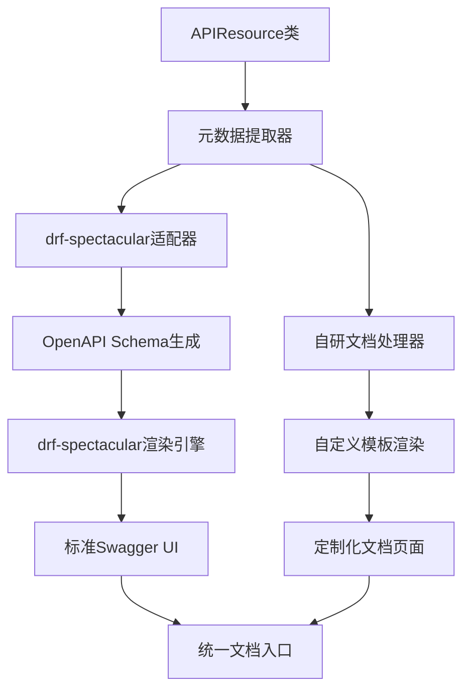
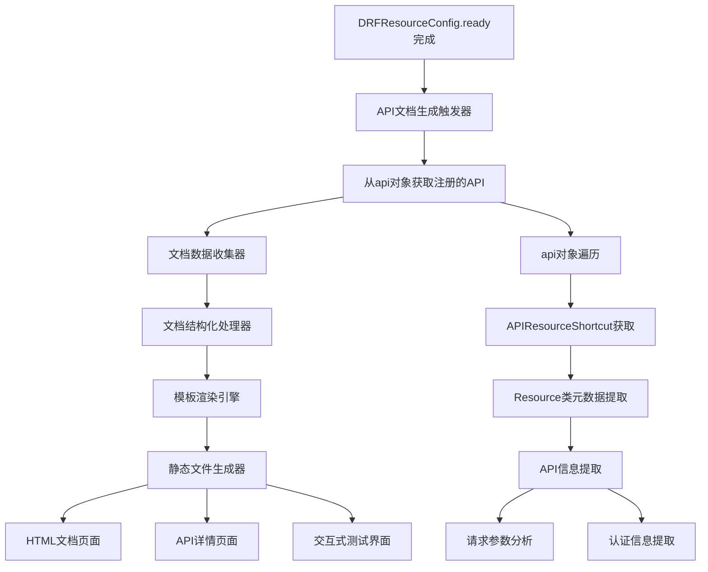
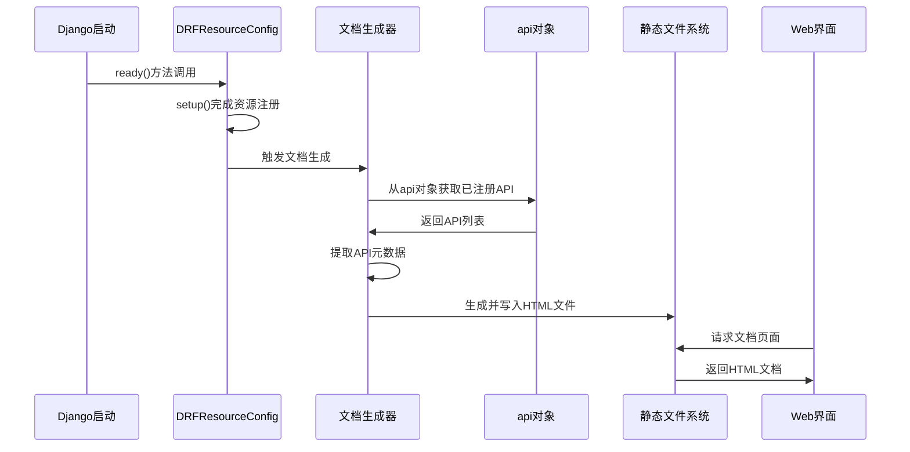

# API文档自动生成系统设计

## 概述

为DRF Resource模块设计一个自动生成API文档的系统，该系统能够扫描通过DRFResourceConfig.ready()方法自动发现的外部API，并生成类似Swagger的可浏览HTML文档页面，提升开发者体验和API的可发现性。

## 需求分析

### 核心需求
- 自动扫描并收集DRF Resource框架注册的所有外部API
- 生成结构化的API文档数据
- 提供类似Swagger UI的可浏览HTML界面
- 支持API分组、搜索和过滤功能
- 展示API的详细信息（参数、响应、示例等）

### 技术背景
- 当前系统已有resource、adapter、api三种资源管理器
- DRFResourceConfig.ready()方法执行完成后，可直接从api对象获取所有已注册的API
- 外部API主要位于bkmonitor/api目录下
- 每个API模块包含多个Resource类，每个类定义了具体的API接口

## 第三方库集成方案

### 推荐的第三方库选择

基于对当前Django REST Framework生态的调研，我们推荐集成以下第三方库来增强API文档生成功能：

| 库名称 | 版本要求 | 主要用途 | 选择理由 |
|--------|----------|----------|----------|
| drf-spectacular | >=0.28.0 | OpenAPI 3.0规范生成和Swagger UI | DRF官方推荐，支持OpenAPI 3.0，功能完善 |
| jinja2 | >=3.0.0 | 自定义模板渲染引擎 | 比Django模板更灵活，支持更丰富的逻辑 |
| mistune | >=2.0.0 | Markdown文档解析 | 支持API描述的Markdown格式解析 |
| pygments | >=2.0.0 | 代码高亮显示 | 为代码示例提供语法高亮 |

### drf-spectacular集成设计

#### 核心优势
- 支持OpenAPI 3.0规范，是DRF官方推荐的文档生成库
- 提供丰富的装饰器和扩展机制，便于自定义
- 自带SwaggerUI和ReDoc界面，用户体验良好
- 支持自动客户端代码生成

#### 集成策略
| 集成层级 | 集成方式 | 实现内容 |
|----------|----------|----------|
| APIResource适配层 | 自定义APIResourceExtension | 为APIResource类提供schema生成支持 |
| 元数据转换层 | 实现CustomSchemaGenerator | 将APIResource元数据转换为OpenAPI格式 |
| 视图集成层 | 扩展SpectacularAPIView | 集成到现有URL路由系统 |
| 界面定制层 | 自定义模板和样式 | 提供符合项目风格的文档界面 |

### 混合架构设计

#### 分工策略
- **drf-spectacular负责**：OpenAPI规范生成、标准Swagger UI界面、客户端代码生成
- **自研组件负责**：APIResource特有元数据处理、自定义布局和样式、业务特定功能

#### 架构流程图




### 组件架构图

采用“第三方库 + 自研组件”的混合架构模式，充分利用成熟的开源方案，同时保持业务特性的灵活性。



### 数据流架构



## APIResource类增强设计

### 增强目标
为了更好地支持API文档生成功能，需要对现有的APIResource类进行适当扩展，增加文档相关的元数据支持，同时保持向后兼容性。

### 新增属性设计

| 属性名称 | 类型 | 默认值 | 说明 |
|---------|------|--------|------|
| api_name | str | None | API的友好名称，用于文档展示 |
| api_description | str | None | API的详细描述说明 |
| api_category | str | "external" | API分类标签（external/internal/deprecated） |
| api_version | str | "v1" | API版本号 |
| api_tags | list | [] | API标签列表，用于分组和筛选 |
| doc_examples | dict | {} | 请求和响应示例数据 |
| doc_hidden | bool | False | 是否在文档中隐藏此API |
| rate_limit | str | None | API限流说明 |
| deprecated | bool | False | 是否已废弃 |
| deprecation_message | str | None | 废弃说明信息 |

### 文档元数据方法

| 方法名称 | 返回类型 | 用途说明 |
|----------|----------|----------|
| get_api_documentation() | dict | 获取完整的API文档信息 |
| get_api_examples() | dict | 获取API使用示例 |
| get_request_schema() | dict | 获取请求参数结构信息 |
| is_documented() | bool | 判断是否应该包含在文档中 |

### 使用示例结构

```text
class QueryDataResource(APIResource):
    # 现有属性保持不变
    action = "/v3/queryengine/query_sync/"
    method = "POST"
    
    # 新增文档属性
    api_name = "数据查询"
    api_description = "执行SQL查询并返回结果数据，支持多种存储引擎"
    api_category = "external"
    api_version = "v3"
    api_tags = ["数据查询", "计算平台"]
    doc_examples = {
        "request": {
            "sql": "SELECT * FROM table_name LIMIT 10",
            "prefer_storage": "clickhouse"
        },
        "description": "查询表中前10条记录"
    }
    rate_limit = "100次/分钟"
```


### APIResource文档支持模块

| 功能组件 | 职责描述 | 实现方式 |
|---------|----------|----------|
| DocumentationMixin | 为APIResource类提供文档相关方法 | Mixin类，提供默认的文档生成逻辑 |
| MetadataValidator | 验证和标准化文档元数据 | 检查属性的有效性和完整性 |
| ExampleValidator | 验证API示例数据的正确性 | 检查示例与序列化器的一致性 |

### API发现与处理模块

| 功能组件 | 职责描述 | 实现方式 |
|---------|----------|----------|
| APICollector | 从api对象获取所有已注册的API | 直接访问drf_resource.management.root.api对象 |
| MetadataExtractor | 提取Resource类的元数据信息 | 反射获取类属性、文档字符串、序列化器 |
| APIGroupClassifier | 按模块对API进行分组分类 | 基于Resource类的模块路径进行分组 |

### 文档数据结构化模块

| 数据实体 | 属性字段 | 用途说明 |
|----------|----------|----------|
| APIModule | name, description, apis, base_url | API模块信息 |
| APIEndpoint | name, method, url, description, request_schema | 单个API端点信息 |
| RequestSchema | parameters, body_schema, authentication | 请求参数结构 |

### 模板渲染与生成模块

| 模板类型 | 文件名称 | 渲染内容 |
|----------|----------|----------|
| 主文档页面 | api_docs_index.html | API概览、模块导航、搜索功能 |
| API详情页面 | api_detail.html | 单个API的详细文档 |
| 交互测试页面 | api_testing.html | 在线API测试工具 |
| 样式文件 | api_docs.css | 文档页面样式定义 |

## 详细设计

### API扫描策略

#### API获取策略
- 从drf_resource.management.root.api对象直接获取已注册的API
- 遍历api对象的所有属性，获取APIResourceShortcut实例
- 提取每个APIResourceShortcut中的Resource类信息
- 过滤掉内部使用的工具类和基础类

#### 元数据提取规则
- 优先使用APIResource类中新增的文档属性（api_name、api_description等）
- 如果新属性为空，则回退到传统方式（类名、文档字符串）
- RequestSerializer提供请求参数schema
- 类属性action、method、base_url提供端点信息
- 利用doc_examples提供实用的调用示例
- 外部API响应格式多样化，不提取响应结构信息
- 支持doc_hidden属性过滤不需要文档化的API

### 文档生成流程

#### 触发时机设计
- Django应用启动时自动触发（在setup()完成后）
- 考虑Resource类延迟加载问题，确保所有模块已预导入
- 提供手动触发的管理命令
- 开发环境下支持热更新机制

#### 生成策略选择
- 静态HTML文件生成：适合生产环境，性能最优
- 动态页面渲染：适合开发环境，支持实时更新
- 混合模式：根据环境自动选择生成策略

### 用户界面设计

#### 主页面布局结构
- 左侧导航栏：API模块树形结构
- 中央内容区：API列表和详情展示
- 右侧工具栏：搜索过滤、快速导航
- 顶部标题栏：项目信息、版本号、帮助链接

#### 交互功能特性
- 支持关键词搜索API名称和描述
- 支持按模块、方法类型筛选
- 提供API收藏和历史记录功能
- 支持一键复制curl命令和代码示例

### 安全与权限控制

#### 访问控制策略
- 仅在开发和测试环境开放访问
- 生产环境需要管理员权限验证
- 支持IP白名单和用户角色控制

#### 敏感信息保护
- 过滤敏感的认证参数和密钥信息
- 对示例数据进行脱敏处理
- 支持配置化的信息隐藏规则

## 技术选型对比

### drf-spectacular vs 自建方案

| 对比维度 | drf-spectacular | 自建方案 | 混合方案（推荐） |
|----------|-----------------|------------|------------------|
| 开发成本 | 低，现成方案 | 高，需要全新开发 | 中，在成熟方案基础上扩展 |
| 标准化程度 | 高，遵循OpenAPI 3.0 | 低，需自定义标准 | 高，兼容标准和自定义 |
| 业务适配性 | 低，APIResource支持有限 | 高，完全定制 | 高，在标准基础上定制 |
| 维护成本 | 低，社区维护 | 高，全部自行维护 | 中，部分依赖社区 |
| 扩展性 | 中，受库设计限制 | 高，无限制 | 高，灵活配置 |
| 生态兼容性 | 高，与大部分工具兼容 | 低，需额外支持 | 高，兼容男方 |

### 最终选择理由

1. **成本效益最优**：在成熟库基础上扩展，降低开发和维护成本
2. **标准化兼容**：遵循OpenAPI规范，保证与各种工具的兼容性
3. **业务适配**：通过自研组件处理APIResource特有的业务需求
4. **技术成熟度**：drf-spectacular是DRF官方推荐，社区活跃，技术成熟


## 集成方案

### 依赖安装配置

```text
# 在requirements.txt中添加
django>=3.2
djangorestframework>=3.12
drf-spectacular>=0.28.0
jinja2>=3.0.0
mistune>=2.0.0
pygments>=2.0.0
```

### Django设置配置

| 配置项 | 配置值 | 说明 |
|--------|--------|------|
| INSTALLED_APPS | 添加'drf_spectacular' | 启用drf-spectacular应用 |
| REST_FRAMEWORK | 'DEFAULT_SCHEMA_CLASS': 'drf_spectacular.openapi.AutoSchema' | 设置默认schema生成器 |
| SPECTACULAR_SETTINGS | API_DOCS_ENABLED: DEBUG | 根据环境控制是否启用 |
| SPECTACULAR_SETTINGS | TITLE: 'DRF Resource API Documentation' | 文档标题 |
| SPECTACULAR_SETTINGS | VERSION: '1.0.0' | API版本号 |

### URL路由配置

考虑到项目规范中的登录认证豁免配置，需要对文档访问路由进行特殊处理：

```text
# 在urls.py中配置
from drf_spectacular.views import SpectacularAPIView, SpectacularSwaggerView
from django.views.decorators.csrf import csrf_exempt
from django.utils.decorators import method_decorator

# 使用@login_exempt装饰器豁免登录认证
urlpatterns = [
    path('api/schema/', SpectacularAPIView.as_view(), name='schema'),
    path('api/docs/', SpectacularSwaggerView.as_view(), name='swagger-ui'),
]
```

### 与现有系统的集成点

| 集成点 | 集成方式 | 影响范围 |
|--------|----------|----------|
| DRFResourceConfig.ready() | 在setup()完成后调用文档生成 | 应用启动流程 |
| api对象 | 直接访问api对象获取已注册资源 | 资源获取机制 |
| Django Settings | 添加文档生成相关配置项 | 项目配置 |
| URL路由 | 注册文档页面的访问路由 | Web访问入口 |

### 配置参数设计

| 配置项 | 默认值 | 说明 |
|--------|--------|------|
| API_DOCS_ENABLED | DEBUG | 是否启用API文档功能 |
| API_DOCS_OUTPUT_DIR | "static/api_docs/" | 文档文件输出目录 |
| API_DOCS_URL_PREFIX | "/api-docs/" | 文档访问URL前缀 |
| API_DOCS_TITLE | "API Documentation" | 文档页面标题 |
| API_DOCS_AUTO_GENERATE | True | 是否自动生成文档 |

### 扩展机制设计

#### 自定义模板支持
- 支持用户提供自定义HTML模板
- 提供模板继承和覆盖机制
- 支持主题配色和样式定制

#### 插件化架构
- 支持自定义的API信息提取器
- 支持第三方文档格式导出
- 支持自定义的访问控制策略

## 实现优先级

### 第一阶段：核心功能
1. 集成drf-spectacular库并配置基础环境
2. 对APIResource类进行扩展，增加文档相关属性
3. 实现APIResource到OpenAPI规范的转换适配器
4. 集成Swagger UI界面并提供访问入口

### 第二阶段：用户体验
1. 定制化Swagger UI界面，符合项目视觉风格
2. 增加搜索、过滤和分组功能
3. 实现API测试工具和交互功能
4. 支持多种文档导出格式（JSON、YAML、PDF）

### 第三阶段：高级特性
1. 集成登录认证豁免配置（@login_exempt）
2. 实现自动客户端代码生成功能
3. 增加版本管理和API变更追踪
4. 提供完整的自动化工具链

### 向后兼容性设计

#### 逐步迁移策略
- 新属性均设置为可选，不影响现有代码
- 提供默认值和回退机制，保证功能正常
- 通过代码扫描工具识别需要更新的APIResource类

#### 文档迁移计划
- 第一阶段：为核心API添加文档属性
- 第二阶段：批量更新bkmonitor/api目录下的API
- 第三阶段：添加更多高级特性和验证机制


## 维护策略

### APIResource类升级策略

#### 属性验证与检查
- 提供管理命令检查所有APIResource类的文档完整性
- 自动检测缺失文档属性的API并生成修改建议
- 验证示例数据与RequestSerializer的一致性

#### 自动化工具支持
- 提供脚本工具自动生成基础文档属性
- 支持从现有文档字符串提取和转换信息
- 集成到CI/CD流程中，保证文档质量

### 文档同步机制
- API变更时自动更新文档
- 支持增量更新和全量重建
- 提供文档版本管理功能

### 性能优化策略
- 采用缓存机制减少重复扫描
- 支持异步生成模式
- 优化大量API的渲染性能

### 监控与日志
- 记录文档生成的执行时间和状态
- 监控文档访问频率和用户行为
- 提供错误报告和问题诊断工具