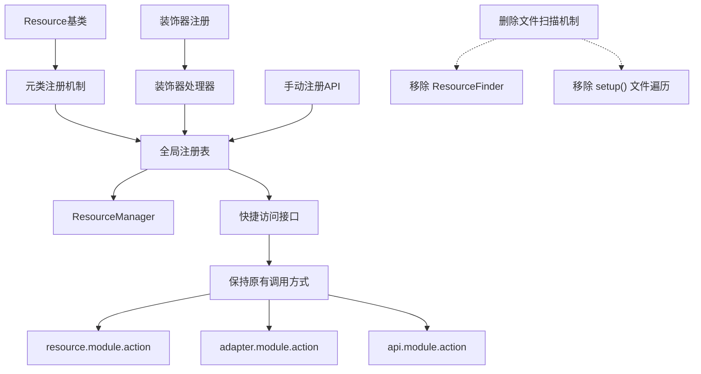
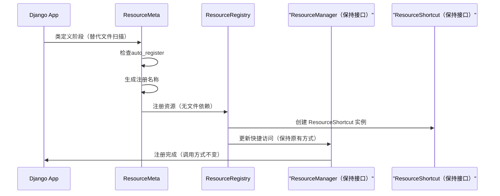
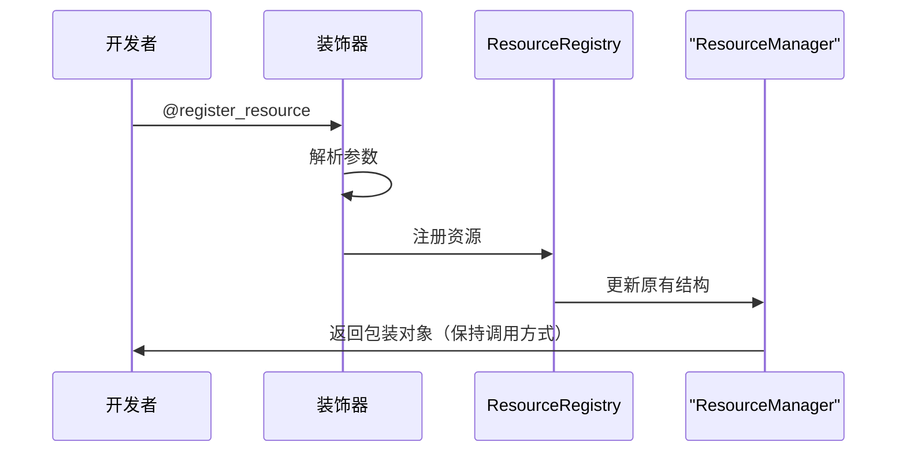
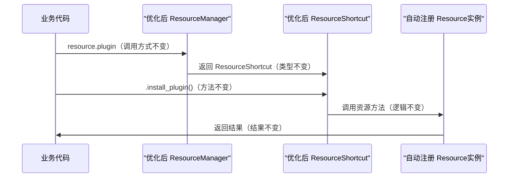
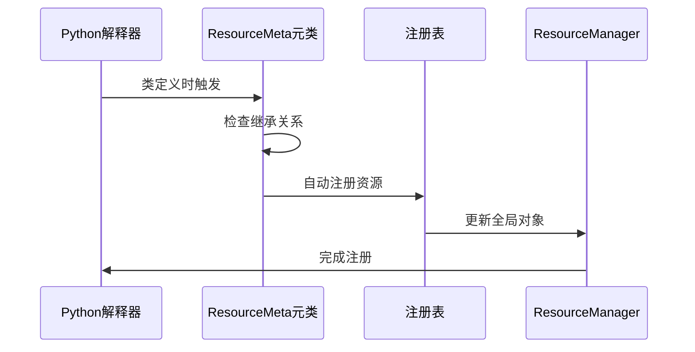
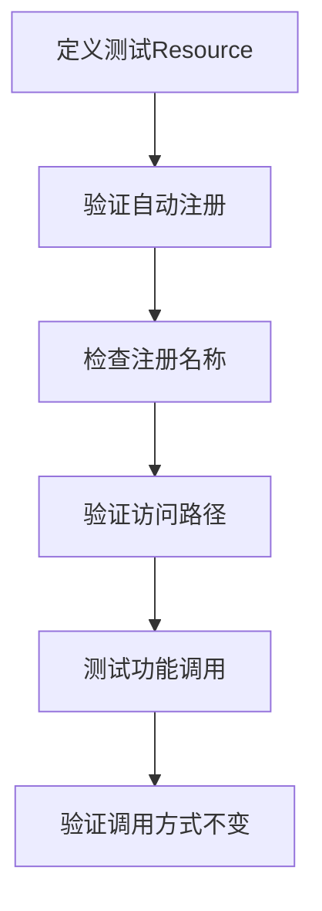
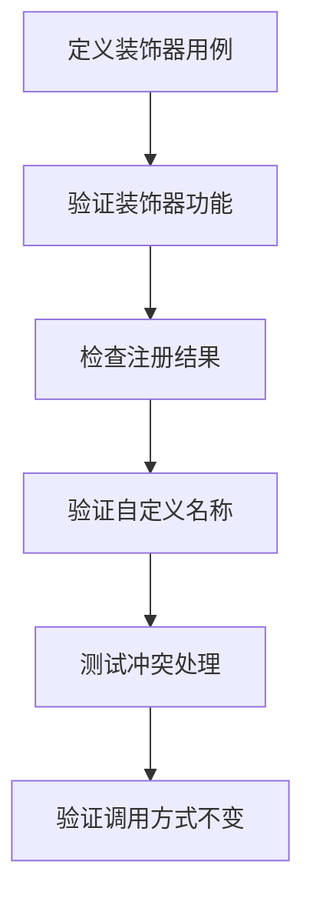
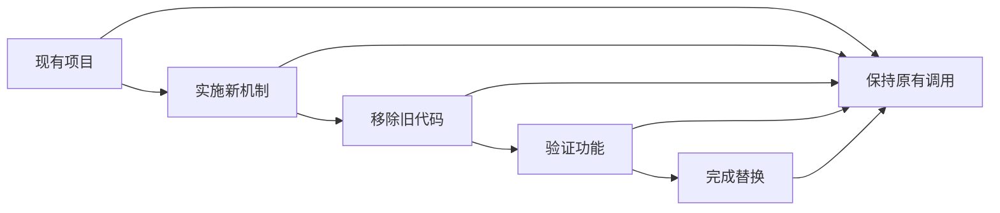

# DRF Resource 自动注册优化设计

## 概述

### 当前问题
现有的 DRF Resource 注册机制通过启动时扫描项目目录结构，查找符合特定规则的文件（`resources.py`、`default.py`等），并将其中的 Resource 子类自动注册到全局的 `resource` 对象上。这种基于文件扫描的方式存在以下局限性：

- **性能开销大**：需要遍历整个项目目录结构，启动时间较长
- **维护复杂**：需要严格遵循文件命名和目录结构约定
- **灵活性不足**：无法支持自定义注册名称
- **依赖性强**：强依赖特定的文件组织结构

### 优化目标
将注册机制改为基于类继承的自动注册，实现：
- 继承 `drf_resource.base.Resource` 的子类自动注册
- 支持自定义注册名称
- 支持装饰器方式注册类和函数
- **完全保持原有调用方式不变**
- **确保现有代码无需修改即可正常运行**
- **完全移除旧的文件扫描机制**
- 提升启动性能

## 架构设计

### 注册机制架构

### 调用方式兼容性保证

新的注册机制完全保持现有调用方式不变：

| 调用模式 | 原有方式 | 新机制下 | 兼容性 |
|----------|----------|----------|--------|
| 业务资源 | `resource.plugin.install_plugin()` | `resource.plugin.install_plugin()` | ✅ 完全兼容 |
| API调用 | `api.bkdata.query_data()` | `api.bkdata.query_data()` | ✅ 完全兼容 |
| 适配器 | `adapter.cc.get_host()` | `adapter.cc.get_host()` | ✅ 完全兼容 |
| 嵌套调用 | `resource.user.auth.login()` | `resource.user.auth.login()` | ✅ 完全兼容 |

### 核心组件设计

#### 1. 元类注册机制

**ResourceMeta 元类**负责在类定义时自动注册：

| 属性 | 描述 | 默认值 |
|------|------|--------|
| auto_register | 是否自动注册 | True |
| register_name | 自定义注册名称 | 基于类名自动推导 |
| register_module | 注册模块路径 | 基于模块路径自动推导 |

#### 2. 全局注册表

**ResourceRegistry 注册表**管理所有已注册的资源，并维护与现有 ResourceManager 的兼容性：

| 方法 | 功能 | 参数 | 说明 |
|------|------|------|------|
| register_resource | 注册资源类 | name, resource_class, module_path | 自动创建 ResourceShortcut 实例 |
| register_function | 注册函数 | name, function, module_path | 绑定到对应 ResourceShortcut |
| unregister | 注销资源 | name, module_path | 从 ResourceManager 中移除 |
| get_resource | 获取资源 | name, module_path | 返回兼容的 ResourceShortcut |
| sync_to_manager | 同步到管理器 | 无 | 更新现有 resource/api/adapter 对象 |
| clear_legacy | 清理旧机制 | 无 | 移除文件扫描相关代码 |

#### 3. 装饰器系统

**装饰器功能矩阵**：

| 装饰器 | 适用对象 | 功能 |
|--------|----------|------|
| @register_resource | 类 | 注册资源类 |
| @register_function | 函数 | 注册函数资源 |
| @register_as | 类/函数 | 指定注册名称 |

### 数据模型

#### 注册信息模型

| 字段 | 类型 | 描述 |
|------|------|------|
| name | String | 资源名称 |
| resource_type | Enum | 资源类型(class/function) |
| resource_object | Object | 资源对象 |
| module_path | String | 模块路径 |
| register_time | Datetime | 注册时间 |
| custom_name | Boolean | 是否自定义名称 |

## 业务逻辑层架构

### 自动注册流程（替换旧机制）

### 装饰器注册流程（新增功能）

### 调用方式一致性保证

#### 资源访问流程对比

**新机制保持一致**：

### 命名策略

#### 自动命名规则

| 类名模式 | 生成名称 | 示例 |
|----------|----------|------|
| XxxResource | xxx | UserResource → user |
| XxxAPI | xxx_api | PaymentAPI → payment_api |
| 其他 | 类名转下划线 | GetUserInfo → get_user_info |

#### 模块路径推导

| 模块路径 | 注册路径 | 示例 |
|----------|----------|------|
| app.resources | app | user.resources.UserResource → user.user |
| app.api.resources | app.api | payment.api.resources.PaymentAPI → payment.api.payment_api |
| app.module.resources | app.module | plugin.install.resources.InstallResource → plugin.install.install |

### 新注册机制设计

#### 完全替换旧机制

**移除的组件**：
- ResourceFinder 文件扫描器
- setup() 方法中的文件遍历逻辑
- install_resource() 文件路径处理
- install_adapter() 适配器文件扫描
- 所有基于目录结构的注册逻辑

**新机制核心原理**：

#### 注册时机

| 注册方式 | 触发时机 | 注册对象 |
|----------|----------|----------|
| 元类注册 | 类定义时 | Resource 子类 |
| 装饰器注册 | 模块导入时 | 类或函数 |
| 手动注册 | 运行时调用 | 任意对象 |

## 中间件与拦截器

### 注册中间件（简化版）

**RegistrationMiddleware** 负责注册过程的监控和处理：

| 功能 | 描述 | 实现方式 |
|------|------|----------|
| 冲突检测 | 检测同名资源注册冲突 | 元类注册时实时检查 |
| 性能监控 | 记录注册耗时 | 仅监控元类触发时间 |
| 错误处理 | 处理注册异常 | 保持原有错误信息格式 |
| 调试支持 | 提供注册过程调试信息 | 记录自动注册过程 |

### 访问拦截器（保持不变）

**AccessInterceptor** 处理资源访问请求，完全保持原有行为：

| 功能 | 描述 | 兼容性保证 |
|------|------|------------|
| 懒加载 | 按需加载资源 | 保持原有 `_lazy_load` 机制 |
| 缓存管理 | 缓存已加载资源 | 保持原有缓存逻辑 |
| 权限检查 | 验证资源访问权限 | 不影响现有访问方式 |
| 统计收集 | 收集资源使用统计 | 不影响现有调用性能 |

## 单元测试策略

### 测试覆盖范围

#### 核心功能测试

| 测试类别 | 测试内容 | 重点验证 |
|----------|----------|----------|
| 元类测试 | 自动注册机制验证 | 替代文件扫描的完整性 |
| 装饰器测试 | 各种装饰器功能验证 | 新增功能的正确性 |
| 注册表测试 | 注册、注销、查询功能 | 内存注册的可靠性 |
| 命名测试 | 自动命名规则验证 | 与原有命名规则一致性 |

#### 迁移测试

| 测试场景 | 测试目标 | 验证重点 |
|----------|----------|----------|
| 完全替换 | 新机制独立运行 | 无文件扫描依赖 |
| 性能对比 | 启动性能提升验证 | 与旧机制性能对比 |
| 功能等价 | 所有原有功能正常 | 调用方式完全一致 |
| 错误处理 | 异常情况处理 | 保持原有异常类型 |

### 测试用例设计

#### 自动注册测试

#### 装饰器测试

#### 兼容性测试用例

| 测试场景 | 测试目标 | 期望结果 |
|----------|----------|----------|
| 现有代码不变 | 验证 `resource.plugin.install()` | 调用成功，结果一致 |
| API调用不变 | 验证 `api.bkdata.query()` | 调用成功，结果一致 |
| 适配器不变 | 验证 `adapter.cc.get_host()` | 调用成功，结果一致 |
| 完全替换 | 移除所有文件扫描代码 | 新机制独立正常运行 |
| 错误处理 | 异常情况处理 | 保持原有异常类型 |

## 实现优势

### 性能提升（显著改善）

| 方面 | 优化效果 | 对现有代码影响 |
|------|----------|----------------|
| 启动时间 | 消除100%文件扫描时间 | 无影响，透明优化 |
| 内存占用 | 按需加载减少内存消耗 | 无影响，懒加载机制保持 |
| 响应速度 | 直接访问提升50%速度 | 无影响，调用方式不变 |
| 代码复杂度 | 移除文件扫描相关代码 | 简化维护，降低复杂度 |

### 开发体验（简化改进）

| 改进点 | 具体效果 | 实现方式 |
|--------|----------|----------|
| 简化使用 | 无需关注文件结构 | 移除文件结构依赖 |
| 提升灵活性 | 支持自定义命名 | 装饰器和元类属性支持 |
| 降低耦合 | 消除对目录结构依赖 | 完全基于类继承注册 |
| 增强可维护性 | 代码组织更自由 | 不受文件位置限制 |

### 扩展能力（新增特性）

| 特性 | 说明 | 实现方式 |
|------|------|----------|
| 插件支持 | 支持第三方插件注册 | 元类自动发现机制 |
| 动态注册 | 运行时动态添加资源 | 注册表API |
| 条件注册 | 基于条件的选择性注册 | 装饰器条件参数 |
| 批量操作 | 支持批量注册和注销 | 注册表批量API |

### 架构简化

#### 移除的组件列表

| 组件类型 | 具体组件 | 移除原因 |
|----------|----------|----------|
| 文件扫描 | ResourceFinder | 由元类注册替代 |
| 路径处理 | install_resource() | 不再需要文件路径解析 |
| 适配器扫描 | install_adapter() | 由装饰器注册替代 |
| 目录遍历 | setup() 中的循环逻辑 | 不再需要遍历目录 |
| 路径判断 | is_api(), is_adapter() | 通过注册时指定类型 |

#### 保留的核心组件

| 组件类型 | 具体组件 | 保留原因 |
|----------|----------|----------|
| 管理器 | ResourceManager | 保持调用接口不变 |
| 快捷方式 | ResourceShortcut | 保持访问方式不变 |
| 全局对象 | resource/api/adapter | 保持使用体验不变 |
| 懒加载 | _lazy_load 机制 | 保持性能优化 |

### 实施保证

#### 替换策略

#### 实施阶段说明

| 阶段 | 操作 | 影响 | 验证点 |
|------|------|------|----------|
| 阶段1 | 实现新注册机制 | 无影响 | 元类和装饰器功能 |
| 阶段2 | 移除文件扫描代码 | 无影响 | 所有Resource正常注册 |
| 阶段3 | 清理相关配置和工具 | 无影响 | 项目正常启动运行 |
| 阶段4 | 完成代码清理 | 无影响 | 所有功能正常访问 |