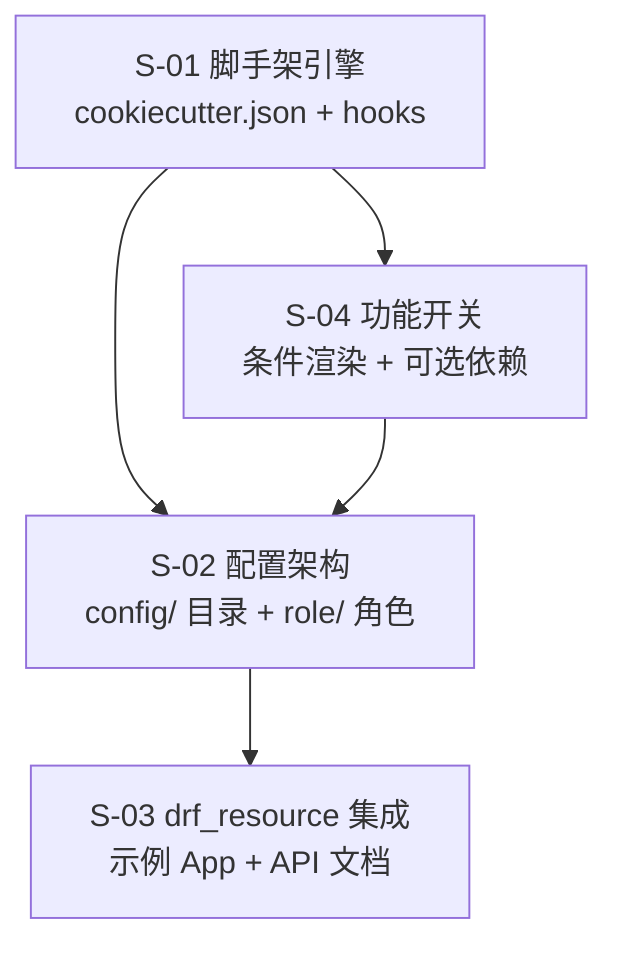
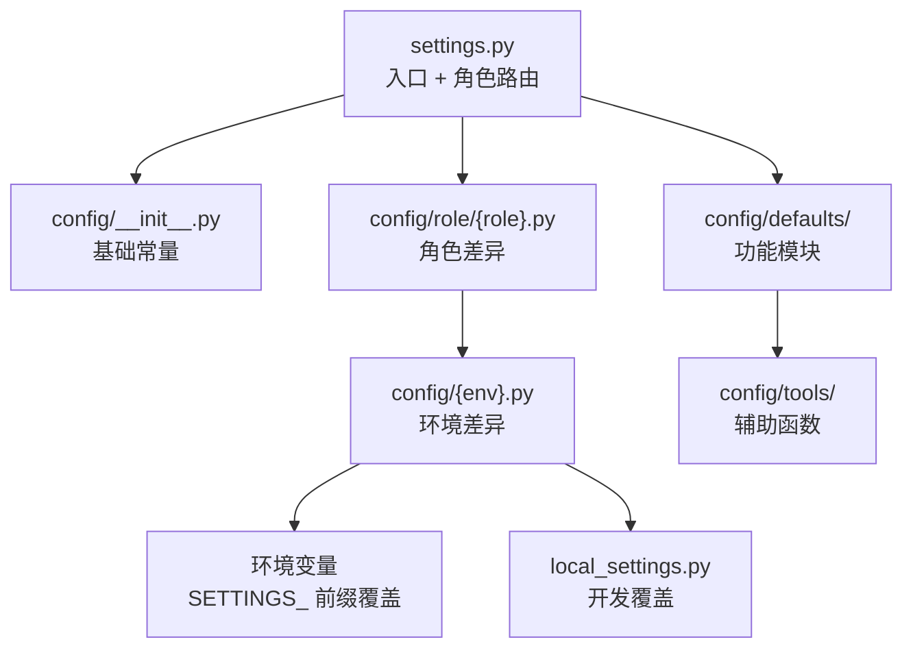

# drf_resource 脚手架模板仓库 — 总体设计

## 1. 需求背景 & 目标

### 背景

drf_resource 是基于 Django REST Framework 的声明式 API 资源框架（提供 Resource → ViewSet → Router 三层架构）。目前缺少项目脚手架模板，新用户需手动搭建 Django 项目。

参考对象：
- **bk-resource**：腾讯蓝鲸的同类框架，使用 cruft + cookiecutter 提供一键模板
- **bk-monitor**：蓝鲸监控平台，拥有成熟的四层分离 + 角色分离配置架构

### 目标

创建独立的脚手架模板仓库 `drf-resource-template`，一行命令生成开箱即用的 Django 项目：

```bash
cruft create https://github.com/HACK-WU/drf-resource-template
```

### 不在范围内

- drf_resource 框架本身的代码修改
- 模板仓库的 CI/CD 流水线搭建
- 蓝鲸 PaaS 平台特定的部署配置
- 前端构建工具链

---

## 2. 关键环节一览图



**依赖说明**：
- S-01 是所有子需求的基础
- S-04 影响 S-02 中 6 个功能模块的条件生成
- S-03 依赖 S-02 的配置就绪

---

## 3. 总体方案设计

### 模板仓库目录结构

```
drf-resource-template/                     # [新增] 独立仓库
├── cookiecutter.json                      # [S-01] 模板变量定义
├── hooks/
│   ├── pre_gen_project.py                 # [S-01] 变量校验
│   └── post_gen_project.py                # [S-01] 生成后引导
└── {{cookiecutter.project_name}}/
    ├── manage.py                          # [S-01] Django 入口（dotenv + gevent patch）
    ├── .env.example                       # [S-01] 环境变量模板
    ├── .gitignore                         # [S-01] Git 忽略规则
    ├── .pre-commit-config.yaml            # [S-01] Pre-commit hooks
    ├── .commitlintrc.json                 # [S-01] Conventional commits 规则
    ├── local_settings.example.py          # [S-01] 开发覆盖模板
    ├── pyproject.toml                     # [S-04] PEP-621 + ruff/pytest/coverage
    ├── requirements.txt                   # [S-04] 依赖条件渲染
    ├── config/
    │   ├── __init__.py                    # [S-02] 基础常量
    │   ├── overview.py                    # [S-02] 配置概览索引
    │   ├── defaults/
    │   │   ├── __init__.py                # [S-02] 功能模块汇总
    │   │   ├── apps.py                    # [S-02] INSTALLED_APPS + MIDDLEWARE
    │   │   ├── database.py                # [S-02] 数据库
    │   │   ├── cache.py                   # [S-02] 缓存
    │   │   ├── rest_framework.py          # [S-02] REST Framework
    │   │   ├── celery.py                  # [S-02] Celery 默认配置（条件生成）
    │   │   ├── cors.py                    # [S-02] CORS（条件生成）
    │   │   ├── i18n.py                    # [S-02] 国际化（条件生成）
    │   │   ├── api_docs.py                # [S-02] API 文档（条件生成）
    │   │   ├── static_files.py            # [S-02] 静态资源
    │   │   ├── session.py                 # [S-02] Session
    │   │   ├── logging.py                 # [S-02] 日志
    │   │   └── env_override.py            # [S-02] 环境变量覆盖
    │   ├── celery/                        # [S-02] Celery app 包（条件生成）
    │   │   ├── __init__.py                # [S-02] 包标记
    │   │   ├── celery.py                  # [S-02] Celery app + autodiscover + signals
    │   │   └── config.py                  # [S-02] Celery Config 类 + beat_schedule
    │   ├── role/
    │   │   ├── __init__.py                # [S-02] 角色包
    │   │   ├── web.py                     # [S-02] Web 角色配置
    │   │   └── worker.py                  # [S-02] Worker 角色配置 + CRONTAB
    │   ├── dev.py                         # [S-02] 开发环境
    │   ├── stag.py                        # [S-02] 测试环境
    │   ├── prod.py                        # [S-02] 生产环境
    │   └── tools/
    │       ├── __init__.py
    │       ├── environment.py             # [S-02] 环境检测
    │       ├── redis.py                   # [S-02] Redis 配置辅助
    │       └── mysql.py                   # [S-02] MySQL 配置辅助（条件生成）
    └── {{cookiecutter.project_name}}/
        ├── __init__.py
        ├── settings.py                    # [S-02] Django settings 入口
        ├── urls.py                        # [S-03] URL 路由
        ├── wsgi.py
        ├── asgi.py
        └── apps/
            ├── __init__.py
            └── example/                   # [S-03] 示例 App
                ├── __init__.py
                ├── resources.py
                ├── viewsets.py
                └── serializers.py
```

### 配置加载流程



### 用户使用流程

```
1. pip install cruft
2. cruft create https://github.com/HACK-WU/drf-resource-template
3. cd {project_name}
4. pip install -r requirements.txt
5. python manage.py migrate
6. python manage.py runserver
```

---

## 4. 全局风险 & 跨子需求依赖

### 共享术语速查

| 术语 | 定义 | 定义位置 |
|------|------|---------|
| cruft | 基于 cookiecutter 的增强工具 | S-01 |
| 功能开关 | cookiecutter 变量控制模板是否包含某功能 | S-04 |
| 条件渲染 | Jinja2 `` 控制模板代码生成 | S-04 |
| 四层+角色配置 | settings → defaults → role → env → 覆盖 | S-02 |
| Resource / ResourceViewSet / ResourceRouter | drf_resource 框架核心抽象 | S-03 |

### 跨子需求风险

| 风险 | 影响范围 | 缓解措施 |
|------|---------|---------|
| cookiecutter.json 变量名变更 | S-01 变量定义 → S-04 条件渲染全部失效 | 变量名作为公共契约，变更前需全局搜索 |
| 配置模块导入顺序变更 | S-02 defaults/__init__.py 顺序 → settings.py 加载失败 | defaults/__init__.py 中注释标注加载顺序约束 |
| drf_resource API 版本不兼容 | S-03 示例代码 → 用户项目无法运行 | 明确 drf-resource 最低版本要求 |

### 关键决策记录

| 编号 | 决策 | 选定方案 | 被否决方案 | 否决理由 |
|------|------|---------|-----------|---------|
| D-01 | 模板仓库位置 | 独立仓库 | 同仓库 template/ | 独立版本管理 |
| D-02 | 脚手架工具 | cruft | 裸 cookiecutter | 支持 check/update/diff |
| D-03 | 配置分层 | 功能模块化 + 角色分离 | 单文件 | 每个功能域独立文件，可维护性强 |
| D-04 | 角色分离 | web + worker | 不纳入模板 | 通用场景下 web/worker 是常见部署模式 |
| D-05 | 数据库默认 | sqlite | MySQL | 零配置运行 |
| D-06 | 日志方案 | 自适应 | 仅 console | 生产需文件日志 |
| D-07 | API 文档 | drf-spectacular | drf-yasg | DRF 官方推荐，OpenAPI 3.0 |
| D-08 | 环境变量覆盖 | SETTINGS_ 前缀 | django-environ | 零额外依赖 |
| D-09 | 静态资源 | whitenoise | nginx | 开发/生产统一 |
| D-10 | config 包位置 | 项目根目录（与 Django 项目包同级） | 嵌入 Django 项目包内 | 与 bk-monitor 一致，settings.py 可直接 `from config import *`；潜在风险：与第三方 config 模块冲突，通过项目根目录在 sys.path 首位缓解 |

### 待定问题

| 编号 | 问题 | 影响 | 建议 |
|------|------|------|------|
| TBD-01 | drf_resource 是否已发布到 PyPI？ | 影响安装方式 | 若未发布，模板需提供 Git 安装方式 |
| TBD-02 | 模板仓库的 GitHub org/owner | 影响 cruft create 命令 | 建议放在 HACK-WU 下 |
| TBD-03 | 是否需要 Dockerfile 模板 | 影响容器化部署体验 | V1 不包含 |
| TBD-04 | 是否需要 Makefile 模板 | 影响常用命令便捷性 | V1 不包含 |

### 影响范围

- 全部为新增文件（~30 个），不修改 drf_resource 框架和 bk-monitor 的任何代码

### 文档索引

| 子需求 | 文档 | 内容 |
|--------|------|------|
| S-01 | [S01_engine_DESIGN.md](S01_engine_DESIGN.md) | cookiecutter.json + hooks 设计 |
| S-02 | [S02_config_DESIGN.md](S02_config_DESIGN.md) | 配置架构 + 角色配置设计 |
| S-03 | [S03_integration_DESIGN.md](S03_integration_DESIGN.md) | drf_resource 集成 + 示例 App |
| S-04 | [S04_switches_DESIGN.md](S04_switches_DESIGN.md) | 功能开关 + 依赖管理 + 更新策略 |
