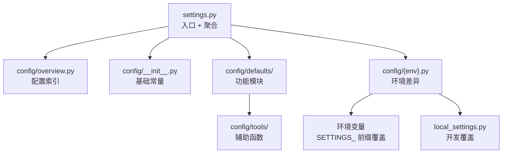

# drf_resource 脚手架模板仓库技术设计

## 1. 术语表

| 术语 | 定义 |
|------|------|
| cruft | 基于 cookiecutter 的增强工具，支持 `create`/`check`/`update`/`diff` 全生命周期管理 |
| 脚手架模板 | cookiecutter 模板仓库，包含 `cookiecutter.json` + Jinja2 渲染的项目文件 |
| 四层配置 | settings.py(入口) → config/overview.py(索引) → config/defaults/功能模块 → config/{env}.py(环境) → config/tools/(辅助) |
| 功能开关 | 通过 cookiecutter 变量控制模板是否包含某些功能（Celery、Redis、CORS 等） |
| 条件渲染 | Jinja2 `` 根据变量开关决定是否生成某段代码 |
| Resource | drf_resource 框架的核心抽象，封装业务逻辑的 `perform_request()` 方法 |
| ResourceViewSet | drf_resource 的 ViewSet 基类，通过 `ResourceRoute` 声明式配置路由 |

## 2. 需求背景 & 目标

### 背景

drf_resource 是基于 Django REST Framework 的声明式 API 资源框架，提供 Resource → ViewSet → Router 三层架构。目前缺少项目脚手架模板，新用户需手动搭建 Django 项目并配置 drf_resource 集成。

参考对象：
- **bk-resource**：腾讯蓝鲸的同类框架，使用 cruft + cookiecutter 提供一键模板
- **bk-monitor**：蓝鲸监控平台，拥有成熟的四层分离配置架构（1900+ 行 default.py）

### 目标

创建一个独立的脚手架模板仓库 `drf-resource-template`，使开发者一行命令生成开箱即用的 Django 项目：

```bash
cruft create https://github.com/HACK-WU/drf-resource-template
```

### 不在范围内

- drf_resource 框架本身的代码修改
- 模板仓库的 CI/CD 流水线搭建
- 蓝鲸 PaaS 平台特定的部署配置
- 前端构建工具链（webpack/vite 等）

## 3. 现状分析（AS-IS）

### 当前 drf_resource 项目结构

```
/root/drf_resource/
├── drf_resource/          # 框架本体（PyPI 包）
│   ├── resources/         # Resource 基类 + APIResource
│   ├── views/             # ResourceViewSet + ResourceRouter
│   ├── response/          # 统一响应格式
│   ├── exceptions/        # 异常体系
│   ├── api_explorer/      # API 文档（Swagger UI）
│   ├── settings.py        # 框架配置（DrfResourceSettings）
│   └── ...
├── tests/
└── pyproject.toml
```

### 问题

1. 新用户 clone drf_resource 后，需要从零搭建 Django 项目并手动集成
2. 缺少标准的配置分层模式，各项目自行发明配置方式
3. 没有模板更新机制，项目升级全靠手动

### bk-resource 的模板方案（参考）

```
bk-resource/
├── bk_resource/           # 框架本体
└── template/              # 模板（同仓库）
    ├── cookiecutter.json  # 变量：app_id, project_name, python_version
    └── {{cookiecutter.project_id}}/
        ├── manage.py
        ├── config/
        └── ...
```

**局限性**：模板与框架同仓库，强耦合蓝鲸 PaaS（blueapps），cookiecutter 变量少（仅 3 个），无功能开关。

### bk-monitor 的配置架构（参考）

```
bkmonitor/config/
├── __init__.py            # 基础常量 + get_env_or_raise
├── default.py             # 1900 行默认配置
├── dev.py / stag.py / prod.py  # 环境差异
├── role/web.py / api.py / worker.py  # 角色差异
└── tools/environment.py / mysql.py / redis.py  # 辅助函数
```

**可提取模式**：环境检测、环境变量覆盖、多数据库、缓存分层、自适应日志、CORS、国际化。

## 4. 总体方案（TO-BE）

### 模板仓库结构

```
drf-resource-template/                     # [新增] 独立仓库
├── cookiecutter.json                      # [新增] 模板变量定义
├── hooks/
│   ├── pre_gen_project.py                 # [新增] 变量校验
│   └── post_gen_project.py                # [新增] 生成后引导
└── {{cookiecutter.project_name}}/
    ├── manage.py                          # [新增] Django 管理入口
    ├── .env.example                       # [新增] 环境变量示例
    ├── .gitignore                         # [新增] Git 忽略规则
    ├── pyproject.toml                     # [新增] PEP-621 项目元数据
    ├── requirements.txt                   # [新增] 依赖锁定
    ├── config/
    │   ├── __init__.py                    # [新增] 基础常量
    │   ├── overview.py                    # [新增] 配置概览索引
    │   ├── defaults/
    │   │   ├── __init__.py                # [新增] 功能模块汇总导入
    │   │   ├── apps.py                    # [新增] INSTALLED_APPS + MIDDLEWARE
    │   │   ├── database.py                # [新增] 数据库配置
    │   │   ├── cache.py                   # [新增] 缓存配置
    │   │   ├── rest_framework.py          # [新增] REST Framework 配置
    │   │   ├── celery.py                  # [新增] Celery 配置（条件生成）
    │   │   ├── cors.py                    # [新增] CORS 配置（条件生成）
    │   │   ├── i18n.py                    # [新增] 国际化配置（条件生成）
    │   │   ├── api_docs.py                # [新增] API 文档配置（条件生成）
    │   │   ├── static_files.py            # [新增] 静态资源配置
    │   │   ├── session.py                 # [新增] Session 配置
    │   │   ├── logging.py                 # [新增] 日志配置
    │   │   └── env_override.py            # [新增] 环境变量覆盖机制
    │   ├── dev.py                         # [新增] 开发环境
    │   ├── stag.py                        # [新增] 测试环境
    │   ├── prod.py                        # [新增] 生产环境
    │   └── tools/
    │       ├── __init__.py
    │       ├── environment.py             # [新增] 环境检测
    │       └── redis.py                   # [新增] Redis 配置辅助
    └── {{cookiecutter.project_name}}/
        ├── __init__.py
        ├── settings.py                    # [新增] Django settings 入口
        ├── urls.py                        # [新增] URL 路由
        ├── wsgi.py                        # [新增] WSGI 入口
        ├── asgi.py                        # [新增] ASGI 入口
        └── apps/
            └── example/
                ├── __init__.py
                ├── resources.py           # [新增] 示例 Resource
                ├── viewsets.py            # [新增] 示例 ViewSet
                └── serializers.py         # [新增] 示例 Serializer
```

### 配置加载流程



### 用户使用流程

```
1. pip install cruft
2. cruft create https://github.com/HACK-WU/drf-resource-template
3. cd {project_name}
4. pip install -r requirements.txt
5. python manage.py migrate
6. python manage.py runserver
```

## 5. 脚手架引擎设计（S-01）

### 5.1 cookiecutter.json

```json
{
    "project_name": "my_project",
    "project_description": "A Django REST Framework project powered by drf_resource",
    "author_name": "Your Name",
    "python_version": ["3.11", "3.12", "3.13"],
    "database_backend": ["sqlite", "mysql", "postgresql"],
    "enable_celery": ["yes", "no"],
    "enable_redis_cache": ["yes", "no"],
    "enable_cors": ["yes", "no"],
    "enable_i18n": ["yes", "no"],
    "enable_api_docs": ["yes", "no"],
    "_copy_without_render": [
        "static",
        "*.css",
        "*.js"
    ]
}
```

**设计决策**：

| 决策 | 选定方案 | 被否决方案 | 否决理由 |
|------|---------|-----------|---------|
| 项目名约束 | 仅允许 `[a-z][a-z0-9_]*` | 允许任意字符串 | Python 包名必须是合法标识符 |
| 变量风格 | `["yes", "no"]` choices | `true`/`false` 布尔值 | cookiecutter 对布尔值支持不完善 |
| 数据库选项 | sqlite/mysql/postgresql | 仅 sqlite | 生产环境需要 MySQL/PG |
| Python 版本 | 3.11+ | 3.8+ | drf_resource 要求 Python >= 3.11 |

### 5.2 hooks/pre_gen_project.py

```python
"""模板变量校验 - 生成前执行"""
import re
import sys

PROJECT_NAME = "{{ cookiecutter.project_name }}"

# 校验项目名格式
if not re.match(r'^[a-z][a-z0-9_]*$', PROJECT_NAME):
    print(f"ERROR: '{PROJECT_NAME}' 不是合法的 Python 包名。")
    print("项目名只能包含小写字母、数字和下划线，且必须以字母开头。")
    print("例如: my_project, demo_app, api_service")
    sys.exit(1)

# 校验项目名不与保留字冲突
RESERVED = {"config", "apps", "tests", "manage", "django", "rest_framework"}
if PROJECT_NAME in RESERVED:
    print(f"ERROR: '{PROJECT_NAME}' 是保留名称，请换一个名称。")
    sys.exit(1)

print(f"✅ 项目名 '{PROJECT_NAME}' 校验通过")
```

### 5.3 hooks/post_gen_project.py

```python
"""生成后引导 - 输出下一步操作"""
import os

PROJECT_NAME = "{{ cookiecutter.project_name }}"
ENABLE_CELERY = "{{ cookiecutter.enable_celery }}" == "yes"

print(f"""
✅ 项目 {PROJECT_NAME} 已生成！

📋 接下来的步骤：

1. 进入项目目录：
   cd {PROJECT_NAME}

2. 创建虚拟环境：
   python -m venv venv
   source venv/bin/activate  # Linux/macOS
   # venv\\Scripts\\activate   # Windows

3. 安装依赖：
   pip install -r requirements.txt

4. 配置环境变量（可选）：
   cp .env.example .env
   # 编辑 .env 文件配置数据库等

5. 初始化数据库：
   python manage.py migrate

6. 启动开发服务器：
   python manage.py runserver
""")

if ENABLE_CELERY:
    print("""
🔧 Celery 已启用，启动 worker：
   celery -A {{ cookiecutter.project_name }} worker -l info
""")

# 清理不需要的文件

# 移除 Celery 相关文件
for f in ["{{ cookiecutter.project_name }}/celery.py"]:
    if os.path.exists(f):
        os.remove(f)

```

## 6. 配置架构设计（S-02）

### 设计原则

原 `config/default.py` 将所有配置混在一个 ~250 行的文件中，难以维护和定位。现拆分为 **按功能域分离的模块**，每个文件职责单一，配合 `overview.py` 概览索引，开发者可快速定位和修改配置。

### 配置文件与功能域的映射关系

| 文件 | 功能域 | 包含的 Django Settings | 条件生成 |
|------|--------|--------------------------|----------|
| `overview.py` | 配置索引 | 无（纯文档） | 否 |
| `apps.py` | Django 核心 | INSTALLED_APPS, MIDDLEWARE, ROOT_URLCONF, TEMPLATES, DEFAULT_AUTO_FIELD | 否 |
| `database.py` | 数据库 | DATABASES, CONN_MAX_AGE | 否 |
| `cache.py` | 缓存 | CACHES | 否 |
| `rest_framework.py` | REST API | REST_FRAMEWORK, DRF_RESOURCE | 否 |
| `celery.py` | 异步任务 | CELERY_BROKER_URL, CELERY_RESULT_BACKEND 等 | `enable_celery` |
| `cors.py` | 跨域 | CORS_ALLOW_ALL_ORIGINS, CORS_ALLOW_CREDENTIALS | `enable_cors` |
| `i18n.py` | 国际化 | LANGUAGE_CODE, USE_I18N, LOCALE_PATHS, LANGUAGES | `enable_i18n` |
| `api_docs.py` | API 文档 | SPECTACULAR_SETTINGS | `enable_api_docs` |
| `static_files.py` | 静态资源 | STATIC_URL, STATIC_ROOT, STATICFILES_STORAGE | 否 |
| `session.py` | Session | SESSION_COOKIE_AGE, SESSION_ENGINE | 否 |
| `logging.py` | 日志 | LOGGING, LOG_LEVEL | 否 |
| `env_override.py` | 环境变量覆盖 | SETTING_ENV_PREFIX + 动态注入 | 否 |

### 6.1 config/__init__.py — 基础常量

```python
"""项目基础常量"""
import os

# 项目标识
APP_CODE = os.getenv("APP_CODE", "{{ cookiecutter.project_name }}")
SECRET_KEY = os.getenv("SECRET_KEY", "change-me-in-production")

# 环境检测
ENVIRONMENT = os.getenv("DJANGO_ENV", "development")
RUN_MODE = {
    "development": "DEVELOP",
    "testing": "TEST",
    "production": "PRODUCT",
}.get(ENVIRONMENT, "DEVELOP")

# 路径
BASE_DIR = os.path.dirname(os.path.dirname(os.path.abspath(__file__)))
PROJECT_ROOT = os.path.dirname(BASE_DIR)


# Celery App（仅启用时导入）
from config.celery import app as celery_app
__all__ = ["celery_app"]

```

### 6.2 config/overview.py — 配置概览索引

```python
"""
配置概览索引
================
本文件说明项目中所有配置模块的用途和内容，供开发者快速定位。

配置加载顺序：
    settings.py → config/defaults/* → config/{env}.py → 环境变量覆盖 → local_settings

配置模块一览：
    config/defaults/apps.py           - Django 核心（INSTALLED_APPS, MIDDLEWARE, TEMPLATES）
    config/defaults/database.py       - 数据库配置（DATABASES, CONN_MAX_AGE）
    config/defaults/cache.py          - 缓存配置（CACHES）
    config/defaults/rest_framework.py - REST Framework + drf_resource 配置
    config/defaults/static_files.py   - 静态资源配置（STATIC_URL, STATIC_ROOT）
    config/defaults/session.py        - Session 配置（SESSION_ENGINE, SESSION_COOKIE_AGE）
    config/defaults/logging.py        - 日志配置（LOGGING, LOG_LEVEL）
    config/defaults/env_override.py   - 环境变量自动覆盖机制

条件生成的配置模块（由 cookiecutter 变量控制）：
    config/defaults/celery.py         - Celery 异步任务（enable_celery）
    config/defaults/cors.py           - CORS 跨域（enable_cors）
    config/defaults/i18n.py           - 国际化（enable_i18n）
    config/defaults/api_docs.py       - API 文档（enable_api_docs）

环境差异配置：
    config/dev.py                     - 开发环境覆盖
    config/stag.py                    - 测试环境覆盖
    config/prod.py                    - 生产环境覆盖

辅助工具：
    config/tools/environment.py       - 环境检测（ENVIRONMENT, RUN_MODE, IS_CONTAINER_MODE）
    config/tools/redis.py             - Redis 配置辅助函数
"""
```

### 6.3 config/defaults/__init__.py — 功能模块汇总导入

```python
"""
功能模块汇总 - 按顺序导入所有配置模块
加载顺序很重要：apps 必须最先加载，其他模块可能依赖 INSTALLED_APPS
"""

# 1. Django 核心（必须最先加载）
from config.defaults.apps import *  # noqa

# 2. 数据库
from config.defaults.database import *  # noqa

# 3. 缓存
from config.defaults.cache import *  # noqa

# 4. REST Framework
from config.defaults.rest_framework import *  # noqa

# 5. 静态资源
from config.defaults.static_files import *  # noqa

# 6. Session
from config.defaults.session import *  # noqa

# 7. 日志
from config.defaults.logging import *  # noqa

# 8. 环境变量覆盖（必须最后加载，确保可覆盖以上所有）
from config.defaults.env_override import *  # noqa

# ---- 条件生成的功能模块 ----


# Celery 异步任务
from config.defaults.celery import *  # noqa



# CORS 跨域
from config.defaults.cors import *  # noqa



# 国际化
from config.defaults.i18n import *  # noqa



# API 文档
from config.defaults.api_docs import *  # noqa

```

### 6.4 config/defaults/apps.py — Django 核心

```python
"""
Django 核心配置 - INSTALLED_APPS / MIDDLEWARE / TEMPLATES
"""
import os
from config import BASE_DIR, PROJECT_ROOT, ENVIRONMENT

DEBUG = ENVIRONMENT == "development"
ALLOWED_HOSTS = ["*"]
DEFAULT_AUTO_FIELD = "django.db.models.AutoField"

INSTALLED_APPS = [
    "django.contrib.admin",
    "django.contrib.auth",
    "django.contrib.contenttypes",
    "django.contrib.sessions",
    "django.contrib.messages",
    "django.contrib.staticfiles",
    # DRF
    "rest_framework",
    # drf_resource
    "drf_resource",
    
    # CORS
    "corsheaders",
    
    
    # Celery
    "django_celery_beat",
    "django_celery_results",
    
    
    # API 文档
    "drf_spectacular",
    
    # 业务 App
    "{{ cookiecutter.project_name }}.apps.example",
]

MIDDLEWARE = [
    
    "corsheaders.middleware.CorsMiddleware",
    
    "django.middleware.security.SecurityMiddleware",
    "whitenoise.middleware.WhiteNoiseMiddleware",
    "django.contrib.sessions.middleware.SessionMiddleware",
    
    "django.middleware.locale.LocaleMiddleware",
    
    "django.middleware.common.CommonMiddleware",
    "django.middleware.csrf.CsrfViewMiddleware",
    "django.contrib.auth.middleware.AuthenticationMiddleware",
    "django.contrib.messages.middleware.MessageMiddleware",
]

ROOT_URLCONF = "{{ cookiecutter.project_name }}.urls"
WSGI_APPLICATION = "{{ cookiecutter.project_name }}.wsgi.application"

TEMPLATES = [
    {
        "BACKEND": "django.template.backends.django.DjangoTemplates",
        "DIRS": [os.path.join(PROJECT_ROOT, "templates")],
        "APP_DIRS": True,
        "OPTIONS": {
            "context_processors": [
                "django.template.context_processors.request",
                "django.contrib.auth.context_processors.auth",
                "django.contrib.messages.context_processors.messages",
                
                "django.template.context_processors.i18n",
                
            ],
        },
    },
]

# 时区
USE_TZ = True
TIME_ZONE = "Asia/Shanghai"
```

### 6.5 config/defaults/database.py — 数据库

```python
"""
数据库配置
"""
import os
from config import APP_CODE, BASE_DIR


DATABASES = {
    "default": {
        "ENGINE": "django.db.backends.sqlite3",
        "NAME": os.path.join(BASE_DIR, "db.sqlite3"),
    }
}

DATABASES = {
    "default": {
        "ENGINE": "django.db.backends.mysql",
        "NAME": os.getenv("DB_NAME", APP_CODE),
        "USER": os.getenv("DB_USER", "root"),
        "PASSWORD": os.getenv("DB_PASSWORD", ""),
        "HOST": os.getenv("DB_HOST", "localhost"),
        "PORT": os.getenv("DB_PORT", "3306"),
        "OPTIONS": {"charset": "utf8mb4", "read_timeout": 300, "connect_timeout": 10},
    }
}

DATABASES = {
    "default": {
        "ENGINE": "django.db.backends.postgresql",
        "NAME": os.getenv("DB_NAME", APP_CODE),
        "USER": os.getenv("DB_USER", "postgres"),
        "PASSWORD": os.getenv("DB_PASSWORD", ""),
        "HOST": os.getenv("DB_HOST", "localhost"),
        "PORT": os.getenv("DB_PORT", "5432"),
    }
}


CONN_MAX_AGE = int(os.getenv("CONN_MAX_AGE", 0))
```

### 6.6 config/defaults/cache.py — 缓存

```python
"""
缓存配置
"""

from config.tools.redis import get_redis_cache_config


CACHES = {
    "default": {
        "BACKEND": "django.core.cache.backends.locmem.LocMemCache",
    },
    "db": {
        "BACKEND": "django.core.cache.backends.db.DatabaseCache",
        "LOCATION": "django_cache",
        "OPTIONS": {"MAX_ENTRIES": 100000, "CULL_FREQUENCY": 10},
    },
}


_redis_cache = get_redis_cache_config()
if _redis_cache:
    CACHES["redis"] = _redis_cache
    CACHES["default"] = _redis_cache

```

### 6.7 config/defaults/rest_framework.py — REST Framework

```python
"""
REST Framework + drf_resource 配置
"""

REST_FRAMEWORK = {
    "DEFAULT_RENDERER_CLASSES": (
        "drf_resource.response.renderers.CustomJSONRenderer",
    ),
    "EXCEPTION_HANDLER": "drf_resource.exceptions.handlers.custom_exception_handler",
    "DEFAULT_PAGINATION_CLASS": "rest_framework.pagination.PageNumberPagination",
    "PAGE_SIZE": 20,
    "DEFAULT_FILTER_BACKENDS": (
        "rest_framework.filters.OrderingFilter",
        "rest_framework.filters.SearchFilter",
    ),
    "DEFAULT_AUTHENTICATION_CLASSES": (
        "rest_framework.authentication.SessionAuthentication",
        "rest_framework.authentication.BasicAuthentication",
    ),
}

DRF_RESOURCE = {
    "ENABLE_API_DOCS": TrueFalse,
    "RESOURCE_DATA_COLLECT_ENABLED": False,
    "RESOURCE_DATA_COLLECT_RATIO": 0.1,
}
```

### 6.8 config/defaults/celery.py — Celery（条件生成）

```python
"""
Celery 异步任务配置
仅当 enable_celery=yes 时生成此文件
"""
import os

CELERY_BROKER_URL = os.getenv("CELERY_BROKER_URL", "redis://localhost:6379/0")
CELERY_RESULT_BACKEND = os.getenv("CELERY_RESULT_BACKEND", "redis://localhost:6379/0")
CELERY_TASK_ALWAYS_EAGER = False
CELERYD_CONCURRENCY = int(os.getenv("CELERYD_CONCURRENCY", 2))
```

### 6.9 config/defaults/cors.py — CORS（条件生成）

```python
"""
CORS 跨域配置
仅当 enable_cors=yes 时生成此文件
"""

CORS_ALLOW_ALL_ORIGINS = True
CORS_ALLOW_CREDENTIALS = True
```

### 6.10 config/defaults/i18n.py — 国际化（条件生成）

```python
"""
国际化配置
仅当 enable_i18n=yes 时生成此文件
"""
import os
from config import PROJECT_ROOT

LANGUAGE_CODE = "zh-hans"
USE_I18N = True
USE_L10N = True
LOCALE_PATHS = [os.path.join(PROJECT_ROOT, "locale")]
LANGUAGES = (("en", "English"), ("zh-hans", "简体中文"))
```

### 6.11 config/defaults/api_docs.py — API 文档（条件生成）

```python
"""
API 文档配置（drf-spectacular）
仅当 enable_api_docs=yes 时生成此文件
"""

REST_FRAMEWORK["DEFAULT_SCHEMA_CLASS"] = "drf_spectacular.openapi.AutoSchema"

SPECTACULAR_SETTINGS = {
    "TITLE": "{{ cookiecutter.project_name }}",
    "DESCRIPTION": "{{ cookiecutter.project_description }}",
    "VERSION": "1.0.0",
    "SERVE_INCLUDE_SCHEMA": False,
}
```

### 6.12 config/defaults/static_files.py — 静态资源

```python
"""
静态资源配置
"""
import os
from config import PROJECT_ROOT

STATIC_URL = "/static/"
STATIC_ROOT = os.path.join(PROJECT_ROOT, "static")
STATICFILES_STORAGE = "whitenoise.storage.CompressedManifestStaticFilesStorage"
```

### 6.13 config/defaults/session.py — Session

```python
"""
Session 配置
"""

SESSION_COOKIE_AGE = 60 * 60 * 24 * 7
SESSION_ENGINE = "django.contrib.sessions.backends.db"
```

### 6.14 config/defaults/logging.py — 日志

```python
"""
自适应日志配置
- 开发/容器环境：仅 console
- 生产环境：file + console
"""
import os
from config import APP_CODE, PROJECT_ROOT, ENVIRONMENT
from config.tools.environment import IS_CONTAINER_MODE

LOG_LEVEL = os.getenv("LOG_LEVEL", "INFO")

_LOG_FORMATTER = {
    "standard": {
        "format": "%(asctime)s %(levelname)-8s %(process)-8d %(name)-15s %(message)s",
        "datefmt": "%Y-%m-%d %H:%M:%S",
    },
}

if IS_CONTAINER_MODE or ENVIRONMENT == "development":
    LOGGING = {
        "version": 1,
        "disable_existing_loggers": False,
        "formatters": _LOG_FORMATTER,
        "handlers": {
            "console": {
                "class": "logging.StreamHandler",
                "level": LOG_LEVEL,
                "formatter": "standard",
            },
        },
        "loggers": {
            "": {"level": LOG_LEVEL, "handlers": ["console"]},
            "django": {"level": "WARNING", "handlers": ["console"], "propagate": False},
        },
    }
else:
    LOG_PATH = os.getenv("LOG_PATH", os.path.join(PROJECT_ROOT, "logs"))
    os.makedirs(LOG_PATH, exist_ok=True)
    LOGGING = {
        "version": 1,
        "disable_existing_loggers": False,
        "formatters": _LOG_FORMATTER,
        "handlers": {
            "console": {
                "class": "logging.StreamHandler",
                "level": LOG_LEVEL,
                "formatter": "standard",
            },
            "file": {
                "class": "logging.handlers.WatchedFileHandler",
                "level": LOG_LEVEL,
                "formatter": "standard",
                "filename": os.path.join(LOG_PATH, f"{APP_CODE}.log"),
                "encoding": "utf-8",
            },
        },
        "loggers": {
            "": {"level": LOG_LEVEL, "handlers": ["console", "file"]},
            "django": {"level": "WARNING", "handlers": ["console", "file"], "propagate": False},
        },
    }
```

### 6.15 config/defaults/env_override.py — 环境变量覆盖

```python
"""
环境变量自动覆盖机制
以 SETTINGS_ 为前缀的环境变量自动注入 Django settings
例：SETTINGS_DEBUG=true → DEBUG = "true"
"""
import os

SETTING_ENV_PREFIX = "SETTINGS_"
for key, value in os.environ.items():
    upper_key = key.upper()
    if upper_key.startswith(SETTING_ENV_PREFIX):
        settings_key = upper_key[len(SETTING_ENV_PREFIX):]
        locals()[settings_key] = value
```

### 6.16 config/tools/environment.py — 环境检测

```python
"""环境检测工具"""
import os

__all__ = ["ENVIRONMENT", "RUN_MODE", "IS_CONTAINER_MODE"]

ENVIRONMENT = os.getenv("DJANGO_ENV", "development")

RUN_MODE = {
    "development": "DEVELOP",
    "testing": "TEST",
    "production": "PRODUCT",
}.get(ENVIRONMENT, "DEVELOP")

# 容器化部署检测
IS_CONTAINER_MODE = os.getenv("DEPLOY_MODE") == "kubernetes" or os.path.exists("/.dockerenv")
```

### 6.17 config/tools/redis.py — Redis 配置辅助

```python
"""Redis 配置辅助"""
import os

def get_redis_url(db: int = 0) -> str:
    """从环境变量构建 Redis URL"""
    host = os.getenv("REDIS_HOST", "localhost")
    port = os.getenv("REDIS_PORT", "6379")
    password = os.getenv("REDIS_PASSWORD", "")
    if password:
        return f"redis://:{password}@{host}:{port}/{db}"
    return f"redis://{host}:{port}/{db}"

def get_redis_cache_config() -> dict | None:
    """构建 Django CACHES 中的 Redis 配置，未配置时返回 None"""
    host = os.getenv("REDIS_HOST")
    port = os.getenv("REDIS_PORT")
    if not host or not port:
        return None
    return {
        "BACKEND": "django_redis.cache.RedisCache",
        "LOCATION": get_redis_url(1),
        "OPTIONS": {
            "CLIENT_CLASS": "django_redis.client.DefaultClient",
        },
    }
```

### 6.18 config/dev.py — 开发环境

```python
"""开发环境配置"""
import os
from config import RUN_MODE

DEBUG = True

# 开发环境使用简化的静态资源路径
STATIC_URL = "/static/"
STATICFILES_STORAGE = "django.contrib.staticfiles.storage.StaticFilesStorage"

# local_settings.py 覆盖（个人开发配置，不纳入版本管理）
if RUN_MODE == "DEVELOP":
    try:
        from local_settings import *  # noqa
    except ImportError:
        pass
```

### 6.19 config/stag.py & config/prod.py

```python
# config/stag.py - 测试环境
"""测试环境配置"""

DEBUG = False
```

```python
# config/prod.py - 生产环境
"""生产环境配置"""
import os

DEBUG = False
ALLOWED_HOSTS = os.getenv("ALLOWED_HOSTS", "*").split(",")


# 生产环境 Session 使用 Redis
if "redis" in CACHES:
    SESSION_ENGINE = "django.contrib.sessions.backends.cache"
    SESSION_CACHE_ALIAS = "redis"



CELERY_BROKER_URL = os.environ["CELERY_BROKER_URL"]
CELERY_RESULT_BACKEND = os.environ["CELERY_RESULT_BACKEND"]
CELERYD_CONCURRENCY = os.getenv("CELERYD_CONCURRENCY", 2)

```

### 6.20 {{cookiecutter.project_name}}/settings.py — 入口

```python
"""
Django settings 入口

加载顺序：
    1. config/__init__.py        → 基础常量（APP_CODE, SECRET_KEY, ENVIRONMENT）
    2. config/defaults/          → 功能模块（apps, database, cache, ...）
    3. config/{env}.py           → 环境差异（dev/stag/prod）
    4. 环境变量覆盖               → SETTINGS_ 前缀自动注入
    5. local_settings.py         → 开发环境个人覆盖
"""
import os

# 1. 加载基础常量
from config import *  # noqa

# 2. 加载功能模块
from config.defaults import *  # noqa

# 3. 加载环境差异配置
DJANGO_CONF_MODULE = "config.{env}".format(
    env={"development": "dev", "testing": "stag", "production": "prod"}.get(
        os.getenv("DJANGO_ENV", "development")
    )
)

try:
    _module = __import__(DJANGO_CONF_MODULE, globals(), locals(), ["*"])
except ImportError as e:
    raise ImportError(f"无法导入配置模块 '{DJANGO_CONF_MODULE}': {e}")

for _setting in dir(_module):
    if _setting == _setting.upper():
        locals()[_setting] = getattr(_module, _setting)


# MySQL 兼容处理（Django 4.2+ 对 MySQL 5.7 做了软性不兼容）
try:
    import pymysql
    pymysql.install_as_MySQLdb()
except ImportError:
    pass

try:
    from django.db.backends.mysql.features import DatabaseFeatures
    from django.utils.functional import cached_property

    class PatchFeatures:
        @cached_property
        def minimum_database_version(self):
            if self.connection.mysql_is_mariadb:
                return 10, 4
            return 5, 7

    DatabaseFeatures.minimum_database_version = PatchFeatures.minimum_database_version
except ImportError:
    pass

```

## 7. drf_resource 集成设计（S-03）

### 7.1 {{cookiecutter.project_name}}/urls.py

```python
"""URL 路由配置"""
from django.contrib import admin
from django.urls import path, include
from drf_resource.views.routers import ResourceRouter
from {{ cookiecutter.project_name }}.apps.example.viewsets import ExampleViewSet

router = ResourceRouter()
router.register("example", ExampleViewSet)

urlpatterns = [
    path("admin/", admin.site.urls),
    path("api/", include(router.urls)),
    # API 文档
    path("api/schema/", SpectacularAPIView.as_view(), name="schema"),
    path("api/docs/", SpectacularSwaggerView.as_view(url_name="schema"), name="swagger-ui"),
    ]


from drf_spectacular.views import SpectacularAPIView, SpectacularSwaggerView

```

### 7.2 示例 App — apps/example/

#### serializers.py

```python
"""示例 Serializer"""
from rest_framework import serializers

class ExampleRequestSerializer(serializers.Serializer):
    name = serializers.CharField(max_length=100, help_text="名称")

class ExampleResponseSerializer(serializers.Serializer):
    id = serializers.IntegerField(help_text="ID")
    name = serializers.CharField(help_text="名称")
    message = serializers.CharField(help_text="响应消息")
```

#### resources.py

```python
"""示例 Resource"""
from drf_resource.resources.base import Resource
from {{ cookiecutter.project_name }}.apps.example.serializers import (
    ExampleRequestSerializer,
    ExampleResponseSerializer,
)

class ExampleResource(Resource):
    """
    示例资源 - 演示 drf_resource 的基本用法
    
    接收一个 name 参数，返回一条问候消息。
    """
    RequestSerializer = ExampleRequestSerializer
    ResponseSerializer = ExampleResponseSerializer

    def perform_request(self, validated_request_data):
        name = validated_request_data["name"]
        return {
            "id": 1,
            "name": name,
            "message": f"Hello, {name}! This is powered by drf_resource.",
        }
```

#### viewsets.py

```python
"""示例 ViewSet"""
from drf_resource.views.viewsets import ResourceViewSet, ResourceRoute
from {{ cookiecutter.project_name }}.apps.example.resources import ExampleResource

class ExampleViewSet(ResourceViewSet):
    """
    示例接口
    
    提供 GET /api/example/ 端点，返回问候消息。
    """
    resource_routes = [
        ResourceRoute(
            method="GET",
            resource_class=ExampleResource,
        ),
    ]
```

## 8. 功能开关设计（S-04）

### 8.1 条件渲染矩阵

| 功能开关 | 影响的文件 | 条件渲染内容 |
|---------|-----------|-------------|
| `enable_celery` | `config/__init__.py`, `defaults/__init__.py`, `defaults/celery.py`, `defaults/apps.py`, `requirements.txt`, `pyproject.toml` | Celery app 导入、INSTALLED_APPS、broker 配置、celery 依赖 |
| `enable_redis_cache` | `defaults/cache.py`, `prod.py`, `requirements.txt` | Redis cache 配置、Session backend 切换、django-redis 依赖 |
| `enable_cors` | `defaults/__init__.py`, `defaults/cors.py`, `defaults/apps.py`, `requirements.txt` | CorsMiddleware、CORS 配置、django-cors-headers 依赖 |
| `enable_i18n` | `defaults/__init__.py`, `defaults/i18n.py`, `defaults/apps.py`, `requirements.txt` | LocaleMiddleware、LOCALE_PATHS、LANGUAGES |
| `enable_api_docs` | `defaults/__init__.py`, `defaults/api_docs.py`, `defaults/rest_framework.py`, `urls.py`, `requirements.txt` | drf-spectacular 配置、schema/docs 端点 |
| `database_backend` | `defaults/database.py`, `settings.py`, `requirements.txt` | 数据库引擎配置、PyMySQL/psycopg2 依赖 |

### 8.2 requirements.txt 条件渲染

```
# 核心依赖
Django>={{ cookiecutter.django_version | default("4.2") }}
djangorestframework>=3.14
drf-resource>=0.1.0
whitenoise>=6.0
python-dotenv>=1.0

# 数据库
pymysql>=1.0
psycopg2-binary>=2.9

# 可选依赖
celery>=5.0
django-celery-beat>=2.5
django-celery-results>=2.5
django-redis>=5.0
redis>=4.0
django-cors-headers>=4.0
drf-spectacular>=0.27

```

### 8.3 pyproject.toml 条件渲染

```toml
[build-system]
build-backend = "setuptools.build_meta"
requires = ["setuptools>=61", "wheel"]

[project]
name = "{{ cookiecutter.project_name }}"
version = "0.1.0"
description = "{{ cookiecutter.project_description }}"
requires-python = ">={{ cookiecutter.python_version }}"
authors = [{ name = "{{ cookiecutter.author_name }}" }]

dependencies = [
    "Django>=4.2",
    "djangorestframework>=3.14",
    "drf-resource>=0.1.0",
    "whitenoise>=6.0",
    "python-dotenv>=1.0",
    "pymysql>=1.0",
    "psycopg2-binary>=2.9",
    "celery>=5.0",
    "django-celery-beat>=2.5",
    "django-redis>=5.0",
    "django-cors-headers>=4.0",
    "drf-spectacular>=0.27",
    ]
```

## 9. 示例应用设计

### 设计目标

生成的项目包含一个 `example` App，演示 drf_resource 的标准用法：

- `resources.py`：展示 Resource + RequestSerializer + ResponseSerializer 模式
- `viewsets.py`：展示 ResourceViewSet + ResourceRoute 声明式路由
- `serializers.py`：展示标准 Serializer 定义

### API 端点

| 方法 | 路径 | 描述 |
|------|------|------|
| GET | `/api/example/?name=xxx` | 返回问候消息 |

### Demo 返回示例

```json
{
    "result": true,
    "code": 200,
    "data": {
        "id": 1,
        "name": "World",
        "message": "Hello, World! This is powered by drf_resource."
    },
    "message": "success"
}
```

## 10. 异常处理

| 场景 | 行为 | 对外暴露 |
|------|------|---------|
| cookiecutter 变量校验失败（项目名不合法） | `pre_gen_project.py` 输出错误信息并 `sys.exit(1)` | 是，控制台输出 |
| cookiecutter 变量校验失败（保留名称冲突） | 同上 | 是，控制台输出 |
| Redis 未配置但 enable_redis_cache=yes | `get_redis_cache_config()` 返回 None，fallback 到 LocMem | 否，静默降级 |
| MySQL 驱动未安装 | `pymysql.install_as_MySQLdb()` 的 try/except 捕获 | 否，跳过 patch |
| 环境变量覆盖值类型不匹配 | 注入为字符串，用户需在代码中自行转换 | 否，使用者责任 |
| cruft update 冲突 | cruft 自带冲突检测，提示用户手动合并 | 是，控制台输出 |
| 生成的项目 pip install 失败（drf_resource 不在 PyPI） | `.env.example` 中提供 Git 安装方式 | 是，文档引导 |

## 11. 模板更新策略

### cruft 生命周期

```
创建项目:   cruft create https://github.com/HACK-WU/drf-resource-template
检查更新:   cruft check
查看差异:   cruft diff
合并更新:   cruft update
```

### 版本兼容策略

- 模板仓库使用语义化版本（semver）
- `cookiecutter.json` 变量向后兼容：新增变量必须有默认值
- 模板更新时，cruft 会生成 diff 供用户逐文件 review
- 用户已修改的文件不会自动覆盖，需要手动 merge

### 与 bk-resource 的差异

| 维度 | bk-resource | drf-resource-template |
|------|------------|----------------------|
| 模板位置 | 同仓库 `template/` 目录 | 独立仓库 |
| 版本管理 | 与框架同步发版 | 独立发版 |
| 功能开关 | 无（3 个变量） | 8 个变量 + 条件渲染 |
| 蓝鲸耦合 | 强耦合 blueapps | 无耦合 |

## 12. 影响范围

### 新增文件

| 文件 | 说明 |
|------|------|
| `cookiecutter.json` | 模板变量定义 |
| `hooks/pre_gen_project.py` | 变量校验 |
| `hooks/post_gen_project.py` | 生成后引导 |
| `{{cookiecutter.project_name}}/**` | 全部为新增文件（~20 个） |

### 对 drf_resource 框架的影响

**无影响**。模板仓库是独立项目，不修改 drf_resource 的任何代码。

### 对 bk-monitor 的影响

**无影响**。仅参考其配置架构模式，不复制其业务代码。

## 13. 关键决策记录

| 编号 | 决策 | 选定方案 | 被否决方案 | 否决理由 |
|------|------|---------|-----------|---------|
| D-01 | 模板仓库位置 | 独立仓库 | 同仓库 template/ | 独立版本管理，模板可单独 fork |
| D-02 | 脚手架工具 | cruft | 裸 cookiecutter | cruft 支持 check/update/diff，全生命周期管理 |
| D-03 | 配置分层 | 功能模块化分离 | 单文件 settings.py | 每个功能域独立文件，配合 overview.py 索引，可维护性强 |
| D-03a | 配置拆分粒度 | 按功能域拆分（13个模块） | 单文件 default.py | 默认值混在一个 ~250 行文件中难以维护和定位 |
| D-04 | 角色分离 | 不纳入模板 | web/api/worker 三角色 | bk-monitor 的角色分离是业务特性，通用模板不需要 |
| D-05 | 数据库默认 | sqlite | MySQL | 开箱即用，零配置即可 runserver |
| D-06 | 日志方案 | 自适应（console/file） | 仅 console | 生产环境需要文件日志 |
| D-07 | API 文档 | drf-spectacular | drf-yasg | drf-spectacular 是 DRF 官方推荐，OpenAPI 3.0 |
| D-08 | 环境变量覆盖 | SETTINGS_ 前缀 | django-environ | 参考 bk-monitor 的原生方案，零额外依赖 |
| D-09 | 静态资源 | whitenoise | nginx + collectstatic | whitenoise 开箱即用，开发/生产统一 |

## 14. 待定问题

| 编号 | 问题 | 影响 | 建议 |
|------|------|------|------|
| TBD-01 | drf_resource 是否已发布到 PyPI？ | 影响 requirements.txt 的安装方式 | 若未发布，模板需提供 Git 安装方式 |
| TBD-02 | 模板仓库的 GitHub org/owner | 影响 `cruft create` 命令 | 建议放在 HACK-WU 下 |
| TBD-03 | 是否需要 Dockerfile 模板 | 影响容器化部署体验 | 建议 V1 不包含，后续补充 |
| TBD-04 | 是否需要 Makefile 模板 | 影响常用命令的便捷性 | 建议 V1 不包含，后续补充 |
