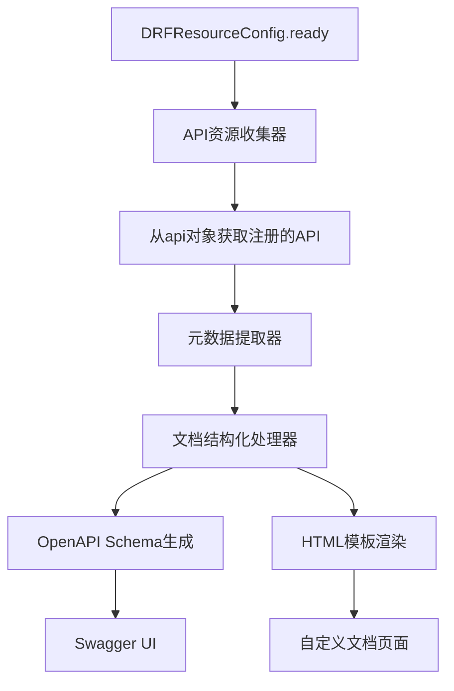

# DRF Resource API文档自动生成系统

## 概述

本项目为 `drf_resource` 模块实现了一个完整的API文档自动生成系统。该系统能够自动扫描和收集通过DRF Resource框架注册的API，并生成类似Swagger的可浏览HTML文档页面，同时支持OpenAPI 3.0规范。

## 功能特性

### 🚀 核心功能
- **自动API发现**: 从 `api` 对象自动收集已注册的API资源
- **文档属性扩展**: 为 `APIResource` 类添加丰富的文档属性支持
- **多种文档格式**: 支持HTML、OpenAPI JSON、ReDoc等多种格式
- **交互式界面**: 提供Swagger UI和ReDoc两种现代化文档界面
- **搜索和过滤**: 支持API搜索、分类过滤和标签筛选
- **完全独立**: 模块设计完全独立，不依赖特定项目

### 📋 文档属性支持
APIResource类现在支持以下文档属性：
- `api_name`: API友好名称
- `api_description`: API详细描述
- `api_category`: API分类 (external/internal/deprecated/beta)
- `api_version`: API版本号
- `api_tags`: API标签列表
- `doc_examples`: 请求和响应示例
- `doc_hidden`: 是否在文档中隐藏
- `rate_limit`: API限流说明
- `deprecated`: 是否已废弃
- `deprecation_message`: 废弃说明

### 🎨 界面特性
- **响应式设计**: 支持桌面端和移动端
- **现代化UI**: 基于现代前端设计理念
- **多主题支持**: 可自定义主题配色
- **交互式测试**: 在线API测试功能

## 安装和配置

### 1. 添加到Django项目

在你的Django项目的 `settings.py` 中：

```python
INSTALLED_APPS = [
    # ... 其他应用
    'rest_framework',
    'drf_spectacular',  # 可选，用于OpenAPI支持
    'drf_resource',
]

# 可选：配置API文档设置
API_DOCS_SETTINGS = {
    'ENABLED': True,
    'AUTO_GENERATE': True,
    'TITLE': '你的项目API文档',
    'VERSION': '1.0.0',
    'DESCRIPTION': '这是项目的API文档描述',
    'URL_PREFIX': '/api-docs/',
}

# 可选：配置DRF Spectacular
REST_FRAMEWORK = {
    'DEFAULT_SCHEMA_CLASS': 'drf_spectacular.openapi.AutoSchema',
}
```

### 2. 添加URL路由

在你的项目的 `urls.py` 中：

```python
from django.urls import path, include

urlpatterns = [
    # ... 其他路由
    path('api-docs/', include('drf_resource.documentation.urls')),
]
```

### 3. 为APIResource添加文档属性

```python
from drf_resource import APIResource

class QueryDataResource(APIResource):
    # 原有属性
    action = "/v3/queryengine/query_sync/"
    method = "POST"
    base_url = "https://api.example.com"
    module_name = "bkdata"
    
    # 新增文档属性
    api_name = "数据查询"
    api_description = "执行SQL查询并返回结果数据，支持多种存储引擎"
    api_category = "external"
    api_version = "v3"
    api_tags = ["数据查询", "计算平台"]
    doc_examples = {
        "request": {
            "sql": "SELECT * FROM table_name LIMIT 10",
            "prefer_storage": "clickhouse"
        },
        "description": "查询表中前10条记录"
    }
    rate_limit = "100次/分钟"
    
    class RequestSerializer(serializers.Serializer):
        sql = serializers.CharField(help_text="查询SQL语句")
        prefer_storage = serializers.CharField(required=False, help_text="首选存储引擎")
```

## 使用方法

### 1. 访问文档页面

启动Django服务器后，访问以下URL：

- **主文档页面**: `http://localhost:8000/api-docs/`
- **Swagger UI**: `http://localhost:8000/api-docs/swagger/`
- **ReDoc**: `http://localhost:8000/api-docs/redoc/`
- **OpenAPI JSON**: `http://localhost:8000/api-docs/openapi.json`

### 2. 生成静态文档

使用Django管理命令生成静态文档：

```bash
# 生成HTML文档
python manage.py generate_api_docs --output-format html

# 生成OpenAPI文档
python manage.py generate_api_docs --output-format openapi

# 生成到指定目录
python manage.py generate_api_docs --output-dir /path/to/output --force
```

### 3. API健康检查

```bash
curl http://localhost:8000/api-docs/health/
```

### 4. 手动重新生成文档

```bash
curl -X POST http://localhost:8000/api-docs/regenerate/
```

## 文档系统架构

### 组件架构

```
drf_resource/
├── documentation/
│   ├── __init__.py              # 模块入口
│   ├── generator.py             # 文档生成器
│   ├── schema.py               # OpenAPI Schema生成
│   ├── extensions.py           # DRF Spectacular扩展
│   ├── mixins.py               # 文档支持Mixin
│   ├── settings.py             # 配置管理
│   ├── views.py                # Web界面视图
│   └── urls.py                 # URL路由配置
├── management/
│   └── commands/
│       ├── generate_api_docs.py # 文档生成命令
│       └── html_generator.py    # HTML生成器
└── templates/
    └── drf_resource/
        ├── api_docs_index.html  # 主文档页面
        ├── swagger_ui.html      # Swagger UI页面
        └── redoc.html          # ReDoc页面
```

### 数据流程



## 配置选项

### API_DOCS_SETTINGS 完整配置

```python
API_DOCS_SETTINGS = {
    # 基础设置
    'ENABLED': True,                    # 是否启用API文档功能
    'AUTO_GENERATE': True,              # 是否自动生成文档
    'TITLE': 'API Documentation',      # 文档标题
    'VERSION': '1.0.0',                # 文档版本
    'DESCRIPTION': 'API文档描述',       # 文档描述
    'URL_PREFIX': '/api-docs/',         # 文档访问URL前缀
    'OUTPUT_DIR': 'static/api_docs/',   # 文档输出目录
    
    # 界面设置
    'THEME': {
        'primary_color': '#1890ff',
        'success_color': '#52c41a',
        'warning_color': '#faad14',
        'error_color': '#f5222d',
    },
    
    # 过滤设置
    'FILTERS': {
        'HIDDEN_MODULES': [],           # 隐藏的模块列表
        'HIDDEN_CATEGORIES': [],        # 隐藏的API类别
        'INCLUDE_TAGS': [],             # 只显示的标签
        'EXCLUDE_TAGS': [],             # 排除的标签
    },
    
    # 权限设置
    'REQUIRE_LOGIN': False,             # 是否需要登录
    'PERMISSION_CLASSES': [],           # 权限类
    
    # 缓存设置
    'CACHE': {
        'ENABLED': True,
        'TIMEOUT': 3600,                # 缓存超时时间（秒）
        'KEY_PREFIX': 'api_docs',
    },
}
```

## 最佳实践

### 1. 文档属性命名规范

```python
class YourAPIResource(APIResource):
    # 使用清晰的中英文API名称
    api_name = "用户信息查询"
    
    # 提供详细的功能描述
    api_description = "根据用户ID查询用户的详细信息，包括基本资料、权限等"
    
    # 使用标准的分类
    api_category = "external"  # external, internal, deprecated, beta
    
    # 遵循语义化版本号
    api_version = "v2.1"
    
    # 使用有意义的标签
    api_tags = ["用户管理", "查询接口", "核心功能"]
    
    # 提供实用的示例
    doc_examples = {
        "request": {
            "user_id": 12345,
            "include_permissions": True
        },
        "response": {
            "user_id": 12345,
            "username": "test_user",
            "email": "test@example.com"
        }
    }
```

### 2. 序列化器文档规范

```python
class UserQueryRequestSerializer(serializers.Serializer):
    user_id = serializers.IntegerField(
        help_text="用户ID，必须是正整数",
        min_value=1
    )
    include_permissions = serializers.BooleanField(
        default=False,
        help_text="是否包含用户权限信息"
    )
    fields = serializers.ListField(
        child=serializers.CharField(),
        required=False,
        help_text="指定返回的字段列表"
    )
```

### 3. 文档组织建议

- 按业务模块组织API
- 使用一致的命名规范
- 提供清晰的示例数据
- 标记废弃的API
- 定期更新文档

## 故障排除

### 常见问题

1. **文档页面无法访问**
   - 检查URL配置是否正确
   - 确认 `ENABLED` 设置为 `True`
   - 查看Django日志错误信息

2. **API未出现在文档中**
   - 检查 `doc_hidden` 是否设置为 `True`
   - 确认API已正确注册到 `api` 对象
   - 查看过滤器设置

3. **文档生成失败**
   - 检查序列化器定义是否正确
   - 确认文档属性格式是否合法
   - 查看生成器日志输出

### 调试模式

启用详细日志输出：

```python
LOGGING = {
    'version': 1,
    'disable_existing_loggers': False,
    'handlers': {
        'console': {
            'class': 'logging.StreamHandler',
        },
    },
    'loggers': {
        'drf_resource.documentation': {
            'handlers': ['console'],
            'level': 'DEBUG',
        },
    },
}
```

## 更新日志

### v1.0.0 (2024-09-24)
- ✨ 首次发布
- 🚀 完整的API文档自动生成系统
- 📱 响应式Web界面
- 🔧 丰富的配置选项
- 📖 完善的使用文档

## 许可证

本项目采用 MIT 许可证。详见 LICENSE 文件。

## 贡献

欢迎提交 Issue 和 Pull Request 来改进本项目！

## 联系方式

如有问题或建议，请通过以下方式联系：
- 提交 GitHub Issue
- 发送邮件至项目维护者